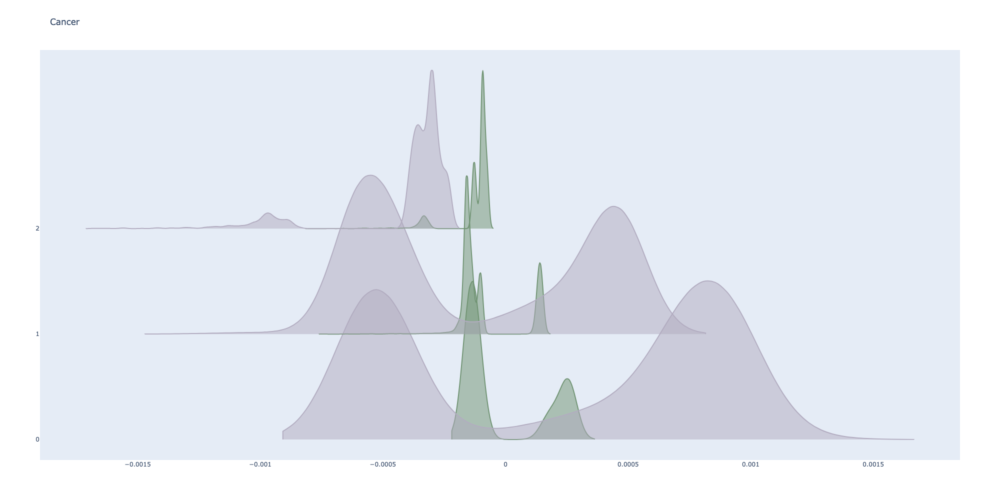

# Results

## Datasets Description

### Labels

Cancer:

- ('Immune', 'Epithelial', 'Stromal')

FACS_CD8:

- ('B cells', 'CD4 T cells', 'CD14+ Monocytes', 'CD56 NK cells', 'Cytotoxic T cells', 'Memory T cells', 'Naive
  Cytotoxic T cells', 'Naive T cells', 'Regulatory T cells')

PBMC_Batch:

- ('NK cells', 'B cells', 'CD4 T cells', 'CD8 T cells', 'CD14+ Monocytes', 'Dendritic cells', 'FCGR3A+
  Monocytes', 'Megakaryocytes')

PBMC_COVID:

- ('Monocytes', 'Dendritic cells', 'B cells', 'NK cells', 'Plasma', 'CD8 T cells', 'CD4 T cells')

cSCC:

- ('Epithelial', 'Fibroblast', 'Endothelial Cell', 'Melanocyte', 'Myeloid cells', 'Tcell', 'B Cell', 'NK')

## Shift Detection

| Dataset    | Label Shift p-value | Label Shift | Covariate Shift p-value | Covariate |     |     |
| ---------- | ------------------- | ----------- | ----------------------- | --------- | --- | --- |
| Cancer     | 1.000               | False       | 0.000                   | True      |     |     |
| FACS_CD8   | 0.1259              | True        | 0.000                   | True      |     |     |
| PBMC_Batch | 0.9801              | False       | 0.000                   | True      |     |     |
| PBMC_COVID | 0.9627              | False       | 0.000                   | True      |     |     |
| cSCC       | 0.9801              | False       | 0.000                   | True      |     |     |

### Label Shift

- The predictions by the trained BBSD on train and test data:

### Covariate Shift

- Using the logits output by the trained BBSD to represent the distributions of the features in train and test data:

### Conclusion

- From the table and the plots, Label Shift holds in the `FACS_CD8`, while Covariate Shift holds in every data set.

- The p-values of the Binomial test from the domain classifiers are all zeros, indicating the existence of domain shift.
